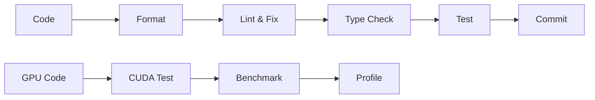

# PyTorch Development Environment with NVIDIA CUDA 12.9

A comprehensive, production-ready PyTorch development environment using NVIDIA's official CUDA container registry with optimized tooling and workflows.

## 🚀 Features

### Core Technologies
- **Base Image**: `nvcr.io/nvidia/cuda:12.9.0-cudnn-runtime-ubuntu24.04`
- **Python**: 3.12 with UV package manager
- **PyTorch**: 2.8+ with CUDA 12.1 support
- **NVIDIA**: Official CUDA runtime with cuDNN support

### Development Tools
- ✅ **ruff**: Fast Python linter and formatter
- ✅ **mypy**: Static type checking with strict configuration
- ✅ **pydantic**: Data validation and settings management
- ✅ **interrogate**: Docstring coverage checking
- ✅ **pytest**: Testing framework with GPU test markers

### Key Optimizations
- **NVIDIA Container Registry**: Official, optimized CUDA base image
- **UV Package Manager**: Fast, reliable Python dependency management
- **Lazy CUDA Loading**: Optimized CUDA module loading
- **Multi-architecture Support**: CUDA arch list for broader GPU compatibility
- **Volume Caching**: Persistent caches for dependencies and models

## 📁 File Structure

```
├── .devcontainer/
│   ├── Dockerfile              # NVIDIA CUDA 12.9 optimized container
│   └── devcontainer.json       # Enhanced devcontainer with NVIDIA features
├── verify_setup/               # Comprehensive verification scripts
│   ├── verify_python.py        # Python environment verification
│   ├── verify_torch.py         # PyTorch and CUDA verification
│   ├── verify_gpu.py           # GPU runtime checks
│   ├── verify_libs.py          # Library imports verification
│   ├── health_check.py         # Container health monitoring
│   ├── gpu_info.py            # GPU information display
│   ├── benchmark.py           # Performance benchmarks
│   ├── system_info.py         # System information
│   └── performance_test.py    # Quick performance tests
├── examples/                   # Example implementations
├── notebooks/                  # Jupyter notebook workspace
├── src/                       # Main source code
├── tests/                     # Test suite
├── pyproject.toml             # NVIDIA-optimized dependencies
├── dev.sh                     # Enhanced development script
└── README.md                  # This file
```

## 🛠️ Development Commands

### Environment Management
```bash
./dev.sh sync              # Sync dependencies with UV
./dev.sh install <pkg>     # Install a package with UV
./dev.sh clean             # Clean caches and temporary files
```

### Code Quality Workflow
```bash
./dev.sh format            # Format code with ruff
./dev.sh lint-fix          # Run ruff with auto-fix
./dev.sh typecheck         # Run mypy type checker
./dev.sh docstring-check   # Check docstring coverage
./dev.sh all-checks        # Run complete quality pipeline
```

### Development Services
```bash
./dev.sh jupyter [port]    # Start Jupyter Lab (default: 8888)
./dev.sh shell             # Shell with activated environment
```

### NVIDIA GPU Diagnostics
```bash
./dev.sh gpu-info          # Show detailed GPU information
./dev.sh benchmark         # Performance benchmarks
./dev.sh verify-setup      # Complete environment verification
./dev.sh doctor           # Full system health check
```

### Testing
```bash
./dev.sh test              # Run test suite
./dev.sh test -m gpu       # Run GPU-specific tests
./dev.sh test -m cuda      # Run CUDA-specific tests
./dev.sh test -m nvidia    # Run NVIDIA-specific tests
```

## 🐳 Container Features

### NVIDIA Integration
- **Official NVIDIA base**: `nvcr.io/nvidia/cuda:12.9.0-cudnn-runtime-ubuntu24.04`
- **CUDA 12.9 runtime**: Latest CUDA with cuDNN support
- **GPU pass-through**: Full GPU access with `--gpus=all`
- **Optimized memory**: 8GB shared memory for multi-processing

### Volume Management
- **Workspace persistence**: `torch-starter-workspace` volume
- **Cache optimization**: Separate volumes for UV, Hugging Face, and PyTorch caches
- **Development continuity**: All work persists across container rebuilds

### Network & Security
- **Host networking**: Direct access to host network interfaces
- **IPC sharing**: Inter-process communication with host
- **Security contexts**: Proper capabilities for debugging and profiling

## 🔧 Environment Variables

### CUDA Optimization
```bash
CUDA_VISIBLE_DEVICES=all           # All GPUs visible
NVIDIA_VISIBLE_DEVICES=all         # NVIDIA runtime config
CUDA_MODULE_LOADING=LAZY           # Lazy CUDA loading
TORCH_CUDA_ARCH_LIST="6.0;6.1;7.0;7.5;8.0;8.6;9.0"  # Multi-arch support
```

### Python Configuration
```bash
PYTHONDONTWRITEBYTECODE=1          # No .pyc files
PYTHONUNBUFFERED=1                 # Real-time output
UV_SYSTEM_PYTHON=1                 # UV system integration
```

### Cache Directories
```bash
HF_HOME=/home/ubuntu/.cache/huggingface     # Hugging Face models
TORCH_HOME=/home/ubuntu/.cache/torch        # PyTorch models
UV_CACHE_DIR=/home/ubuntu/.cache/uv         # UV package cache
```

## 🎯 Quick Start

1. **Clone and open in VS Code with Dev Containers extension**
2. **Wait for automatic setup** (dependencies sync, verification)
3. **Verify CUDA setup**:
   ```bash
   ./dev.sh gpu-info
   ./dev.sh verify-setup
   ```
4. **Start developing**:
   ```bash
   ./dev.sh jupyter  # For notebook development
   # or
   ./dev.sh shell    # For CLI development
   ```

## 🧪 Testing Your Setup

### Quick Verification
```bash
# Run comprehensive verification
./dev.sh doctor

# Check GPU status
./dev.sh gpu-info

# Run performance benchmarks
./dev.sh benchmark
```

### PyTorch CUDA Test
```python
import torch

# Check CUDA availability
print(f"CUDA available: {torch.cuda.is_available()}")
print(f"CUDA devices: {torch.cuda.device_count()}")

# Test GPU computation
if torch.cuda.is_available():
    x = torch.randn(1000, 1000, device='cuda')
    y = torch.randn(1000, 1000, device='cuda')
    z = torch.mm(x, y)
    print(f"GPU computation successful: {z.device}")
```

## 📦 Dependencies

### Core Scientific Stack
- **NumPy**: Scientific computing foundation
- **Pandas**: Data manipulation and analysis
- **SciPy**: Scientific algorithms
- **Scikit-learn**: Machine learning utilities
- **Matplotlib**: Plotting and visualization

### PyTorch Ecosystem (NVIDIA Optimized)
- **PyTorch**: Deep learning framework with CUDA 12.1 support
- **torchvision**: Computer vision utilities
- **torchaudio**: Audio processing utilities

### Hugging Face Ecosystem
- **transformers**: State-of-the-art NLP models
- **datasets**: Machine learning datasets
- **accelerate**: Distributed training utilities
- **safetensors**: Safe tensor serialization

### NVIDIA GPU Utilities (Optional)
- **nvidia-ml-py**: NVIDIA Management Library
- **nvidia-cudnn-cu12**: cuDNN for CUDA 12
- **nvidia-cublas-cu12**: cuBLAS for CUDA 12
- **cupy-cuda12x**: NumPy-like library for GPU

## 🏗️ Architecture

### Multi-Stage Docker Build
1. **Base Stage**: NVIDIA CUDA runtime setup
2. **User Setup**: Non-root user configuration
3. **UV Installation**: Fast package manager setup
4. **Environment Creation**: Python virtual environment
5. **Final Configuration**: Optimizations and shell integration

### Development Workflow


## 🔍 Verification Scripts

### Python Environment (`verify_setup/verify_python.py`)
- Python version validation (3.11+)
- Virtual environment detection
- Workspace directory validation

### PyTorch & CUDA (`verify_setup/verify_torch.py`)
- PyTorch installation and version
- CUDA availability and version
- Basic CUDA tensor operations

### GPU Runtime (`verify_setup/verify_gpu.py`)
- nvidia-smi availability
- GPU hardware information
- CUDA toolkit version
- PyTorch CUDA integration

### Library Dependencies (`verify_setup/verify_libs.py`)
- Core scientific packages
- ML/DL framework availability
- Import performance timing

### System Health (`verify_setup/health_check.py`)
- Container health monitoring
- Basic functionality verification
- Used by Docker HEALTHCHECK

## 🎛️ VS Code Integration

### Extensions
- **Python**: Core Python support
- **Pylance**: Advanced language server
- **Jupyter**: Notebook support
- **Ruff**: Linting and formatting
- **GitHub Copilot**: AI assistance
- **TensorBoard**: ML visualization
- **NVIDIA Nsight**: GPU profiling and debugging

### Settings Optimization
- Python interpreter auto-detection
- File watcher exclusions for performance
- Search exclusions for large directories
- Port forwarding for development servers

## 🚨 Troubleshooting

### CUDA Issues
```bash
# Check NVIDIA driver
nvidia-smi

# Verify CUDA installation
./dev.sh verify-setup

# Test PyTorch CUDA
python -c "import torch; print(torch.cuda.is_available())"
```

### Container Issues
```bash
# Rebuild container
# In VS Code: Ctrl+Shift+P -> "Dev Containers: Rebuild Container"

# Check container logs
docker logs <container_id>

# Manual verification
./dev.sh doctor
```

### Performance Issues
```bash
# Check GPU utilization
nvidia-smi -l 1

# Run benchmarks
./dev.sh benchmark

# Profile code
./dev.sh test --benchmark-only
```

## 🤝 Contributing

1. **Fork** the repository
2. **Create** a feature branch
3. **Run** quality checks: `./dev.sh all-checks`
4. **Commit** with descriptive messages
5. **Push** and create a Pull Request

### Code Quality Standards
- **Type hints**: All functions must have type annotations
- **Docstrings**: Google-style docstrings for public APIs
- **Tests**: GPU-specific tests marked with `@pytest.mark.gpu`
- **Performance**: Benchmark critical code paths

## 📄 License

MIT License - see LICENSE file for details.

## 🙏 Acknowledgments

- **NVIDIA**: For providing optimized CUDA container images
- **PyTorch Team**: For CUDA integration and optimization
- **Astral**: For the UV package manager
- **Microsoft**: For VS Code Dev Containers

---

**Ready to accelerate your PyTorch development with NVIDIA CUDA? 🚀**